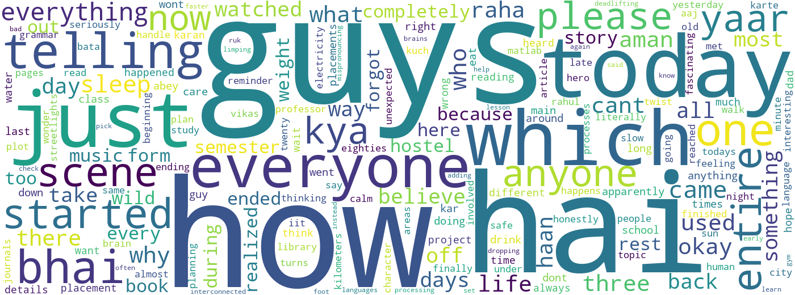

# GroupDNA

GroupDNA is a Python-based analytics project designed to transform exported WhatsApp group chats into meaningful behavioral and communication insights. It takes raw chat data, parses it into structured records, and generates a rich set of analyses such as activity trends, interaction patterns, popular words, response behavior, and personality-based participant profiles.

The project is especially useful for understanding how a group behaves over time, who contributes the most, when the group is most active, and what themes appear repeatedly in conversation. It combines data processing, visualization, and reporting into a workflow that can be used both for research and for presenting group dynamics in a clear, visual way.

## What this project does

GroupDNA can:

- Parse exported WhatsApp chat files into structured message data.
- Handle system messages, media notifications, multiline messages, and deleted message markers.
- Measure overall group activity and identify the most active participants.
- Detect the busiest days and busiest hours of communication.
- Create activity heatmaps for weekly and daily engagement patterns.
- Extract frequently used words and meaningful conversation themes.
- Analyze response times and silent streaks.
- Classify participants into personality archetypes based on communication behavior.
- Generate a final report and visual outputs for presentation and sharing.

## Why this project is useful

This project helps turn raw chat history into understandable insights for:

- Group admins and community managers
- Researchers studying online communication behavior
- Teams interested in participation and engagement patterns
- Anyone who wants to explore chat data visually and analytically

## Project workflow

1. Upload or place a WhatsApp chat export in the dataset or data folder.
2. Run the parsing and analysis notebooks in the Development folder.
3. Generate intermediate outputs and analytics summaries.
4. Produce visualizations and a final report for review.

## Repository structure

- Development/: Notebook-based analysis pipeline
- Data/: Intermediate data files and processed outputs
- Dataset/: Sample WhatsApp chat data
- Streamlit_App/: Interactive Streamlit dashboard version of the project
- Final_Submission/: Final visual outputs, report, and presentation assets

## Main visual outputs

The following images are included from the final submission folder to showcase the project results directly on GitHub.

### Activity analysis

.png)

### Time-based insights

.png)

### Personality archetypes

.png)

### Heatmap analysis

.png)

### Word and message insights

.png)

### Word cloud

## Project report

A complete report for the project is available here:

- [GroupDNA project report](Final_Submission/GroupDNA_Project_Report.pdf)

## Streamlit app setup

For step-by-step instructions to install the required packages and run the app, see [STREAMLIT_SETUP.md](STREAMLIT_SETUP.md).

## Tech stack

- Python
- Pandas
- Plotly
- Streamlit
- WordCloud
- ReportLab
- Jupyter Notebook

## Notes

This repository currently includes both a notebook-driven analysis workflow and an interactive Streamlit app, making it suitable for both technical exploration and user-friendly presentation.